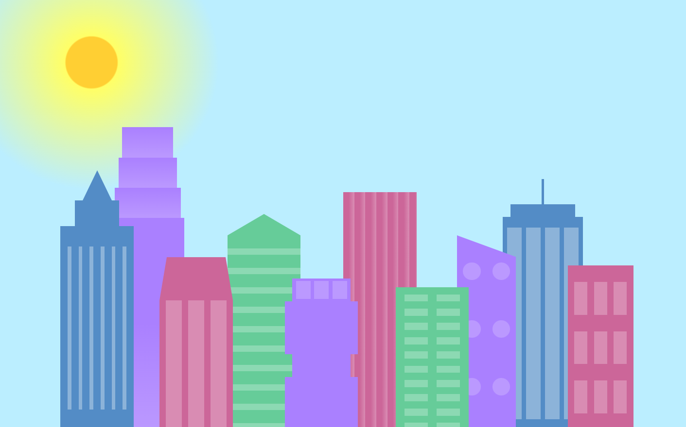
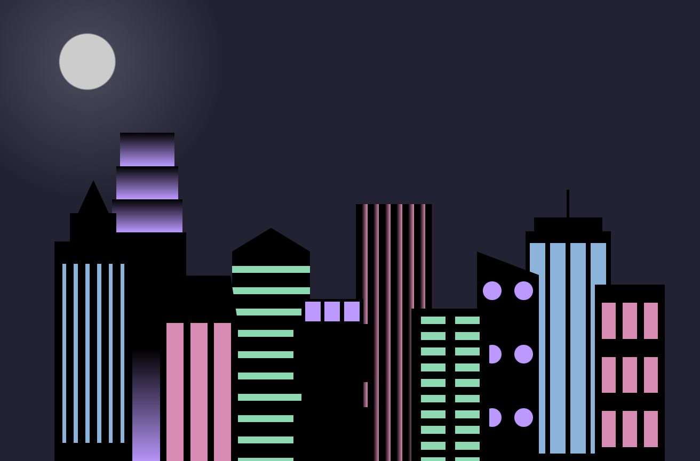

# 🌆 City Skyline

> 🏙️ **This project is one of the required projects for the _Responsive Web Design Certification_ from freeCodeCamp.**
A visually appealing **City Skyline** webpage built entirely with **HTML** and **CSS**, featuring foreground and background buildings, day-to-night gradient transitions, and a responsive design that adapts to screen width changes.
This project demonstrates semantic HTML, advanced CSS gradients, CSS variables, responsive design techniques, and layered UI styling.
> 


## 🌟 Features
- 🎨 **Dynamic gradients:** Day-to-night sky transitions using `radial-gradient`
- 🏢 **Layered buildings:** Foreground and background buildings with windows
- 🌙 **Responsive design:** Skyline adapts to viewport width, changing colors for day and night
- 🔤 **Elegant styling:** CSS variables for building and window colors
- 📐 **Advanced CSS techniques:**
  - Repeating linear gradients for building textures
  - Media queries for responsive night mode
  - Layered backgrounds for depth
## 🚀 How to Run
1. Clone the repository:
   ```bash
   git clone https://github.com/Natalia939/city-skyline-css-freecodecamp.git

2. Navigate to the project folder:  
     ```bash
    cd city-skyline-css-freecodecamp
     ```
3. Open `index.html` in your browser

- 👩‍💻 Author: **Natalia Gvozdovska – Web Developer & Designer**
- Created on: November 24, 2025
